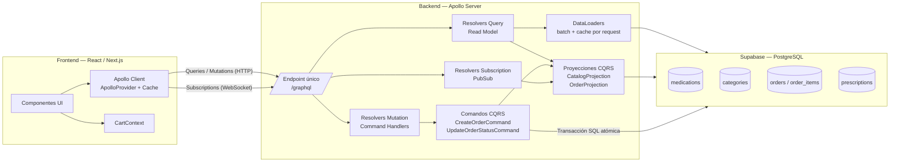

# Afirmative Pill — Arquitectura GraphQL + CQRS
### Taller Práctico Avanzado — E-Commerce Farmacéutico

Repositorio con la solución completa del caso de estudio: backend GraphQL
(Apollo Server) con arquitectura CQRS y persistencia en Supabase, y frontend
React/Next.js con Apollo Client, cumpliendo el **Zero-REST Mandate**.

---

## 1. Diagrama de arquitectura



**Flujo resumido:** el cliente nunca llama REST; todo viaja por `/graphql`.
Las *Queries* leen del **read model** (proyecciones optimizadas y
DataLoaders para evitar N+1). Las *Mutations* son **comandos de dominio**
que pasan por un *Command Handler* que valida invariantes de negocio antes
de tocar la base de datos. Las *Subscriptions* notifican en tiempo real
cuando cambia el estado del pedido, resolviendo la consistencia eventual
en la UI.

---

## 2. Cómo se aplicó CQRS

| | Write Model (Comandos) | Read Model (Proyecciones) |
|---|---|---|
| Entrada | `CreateOrderCommand`, `UpdateOrderStatusCommand` (`backend/src/cqrs/commands`) | `CatalogProjection`, `OrderProjection` (`backend/src/cqrs/projections`) |
| Responsabilidad | Expresar intención de negocio, validar invariantes, mutar estado | Servir datos ya modelados para lectura eficiente |
| Dónde vive | `Mutation.createOrder` / `Mutation.updateOrderStatus` → `OrderCommandHandler` | `Query.medications`, `Query.medication`, `Query.order` |
| Garantías | Transacción SQL (`BEGIN/COMMIT/ROLLBACK`) + `SELECT ... FOR UPDATE` para reservar stock de forma atómica bajo concurrencia | Consultas de sólo lectura, sin locks, optimizadas con índices (`idx_medications_category`, índice GIN de texto) |

**Invariantes de negocio protegidas en el Command Handler** (nunca en el
frontend):
1. No se descuenta stock si la cantidad solicitada supera el inventario.
2. Si **cualquier** ítem tiene `requires_prescription = true`, el comando
   exige `prescription.documentUrl` — si no llega, se rechaza el pedido
   completo **antes** de tocar inventario (invariante "todo o nada").
3. Transiciones de estado del pedido restringidas a una máquina de estados
   explícita (`PENDING_APPROVAL → APPROVED/CANCELLED → DISPATCHED`), ver
   `UpdateOrderStatusCommand.ALLOWED_TRANSITIONS`.

**Consistencia eventual:** tras `createOrder`, el pedido queda en
`PENDING_APPROVAL`. El cliente consulta la proyección (`Query.order`) y
además se suscribe a `orderStatusChanged` para reflejar, sin recargar la
página, el momento en que el pedido pasa a `APPROVED` o `DISPATCHED`.

---

## 3. Cómo se mitigó el problema N+1

Sin DataLoader, una consulta como:

```graphql
{ medications { items { commercialName category { name } } } }
```

dispararía 1 consulta para el listado + 1 consulta **por cada** medicamento
para resolver su categoría (N+1). Lo mismo ocurre al resolver `Order.items`
→ `OrderItem.medication`.

**Solución implementada** (`backend/src/dataloaders/index.js`):
- Se crea un set de `DataLoader` **nuevo por cada request** en
  `context.js` (caché por request, sin fugas entre usuarios).
- Cada resolver anidado (`Medication.category`, `OrderItem.medication`,
  `Order.items`) llama a `loader.load(id)` en vez de consultar la BD
  directamente.
- DataLoader espera un tick del event loop, junta todas las claves
  pedidas en ese ciclo y ejecuta **una sola consulta** en lote:
  `SELECT * FROM medications WHERE id = ANY($1::uuid[])`.
- Resultado medible: para un listado de 100 medicamentos con categoría,
  se pasa de 101 consultas potenciales a **2** (una para el listado, una
  para todas las categorías referenciadas).

---

## 4. Estructura del repositorio

```
afirmative-pill/
├── backend/
│   ├── src/
│   │   ├── schema/schema.graphql       # SDL completo (Query/Mutation/Subscription)
│   │   ├── db/pool.js                  # Conexión a Supabase Postgres
│   │   ├── dataloaders/index.js        # Batching + cache por request (N+1)
│   │   ├── cqrs/
│   │   │   ├── commands/commands.js         # CreateOrderCommand, UpdateOrderStatusCommand
│   │   │   ├── handlers/OrderCommandHandler.js  # Valida invariantes + transacción SQL
│   │   │   ├── projections/catalogProjection.js # Read model del catálogo
│   │   │   ├── projections/orderProjection.js    # Read model del pedido
│   │   │   └── eventBus.js                  # PubSub para Subscriptions
│   │   ├── resolvers/                  # Query, Mutation, Subscription, tipos anidados
│   │   ├── context.js                  # Loaders nuevos por request
│   │   └── index.js                    # Apollo Server (HTTP + WS)
│   ├── package.json
│   └── .env.example
├── frontend/
│   ├── pages/
│   │   ├── _app.jsx                    # ApolloProvider + CartProvider
│   │   ├── index.jsx                   # Catálogo (Escenario A)
│   │   ├── medicamento/[id].jsx        # Ficha técnica (Escenario A)
│   │   ├── carrito.jsx                 # Carrito + createOrder (Escenario B)
│   │   └── pedido/[id].jsx             # Seguimiento + Subscription (Escenario C)
│   ├── src/
│   │   ├── lib/apolloClient.js         # HTTP + WS split link, InMemoryCache
│   │   ├── graphql/                    # queries.js, mutations.js, subscriptions.js
│   │   └── context/CartContext.jsx
│   └── package.json
├── dataset/
│   └── seed.sql                        # Tablas + 50 medicamentos reales
└── README.md
```

---

## 5. Instrucciones de arranque

### 5.1. Base de datos (Supabase)
1. Crear un proyecto en [supabase.com](https://supabase.com).
2. Ir a **SQL Editor** y ejecutar el contenido completo de `dataset/seed.sql`
   (crea tablas `categories`, `medications`, `orders`, `order_items`,
   `prescriptions` y carga los 50 medicamentos).
3. Copiar la *connection string* en **Project Settings → Database**.

### 5.2. Backend
```bash
cd backend
npm install
cp .env.example .env
# Editar .env con SUPABASE_DB_URL
npm run dev
# API disponible en http://localhost:4000/graphql
```

### 5.3. Frontend
```bash
cd frontend
npm install
cp .env.local.example .env.local
npm run dev
# App disponible en http://localhost:3000
```

### 5.4. Flujo de prueba end-to-end
1. Abrir `http://localhost:3000`, buscar un medicamento OTC (ej. Dolex) y
   agregarlo al carrito.
2. Ir a `/carrito` y confirmar el pedido → se ejecuta `createOrder`.
3. Ser redirigido a `/pedido/[id]` → ver la proyección del pedido.
4. Desde Apollo Studio o cualquier cliente GraphQL, ejecutar
   `updateOrderStatus` sobre ese pedido → el estado se actualiza **en vivo**
   en la pantalla de seguimiento (Subscription).
5. Repetir el flujo con un medicamento `requiresPrescription: true` sin
   adjuntar `documentUrl` → el comando debe rechazar el pedido con un
   error de validación explícito.

---

## 6. Verificación de la restricción Zero-REST

Con las DevTools del navegador abiertas en la pestaña **Network**, todas
las llamadas del frontend (catálogo, ficha, carrito, seguimiento) deben
apuntar únicamente a `POST /graphql` (HTTP) y a la conexión WebSocket de
`/graphql` (subscriptions). No existe ningún otro endpoint HTTP expuesto
por el backend.
